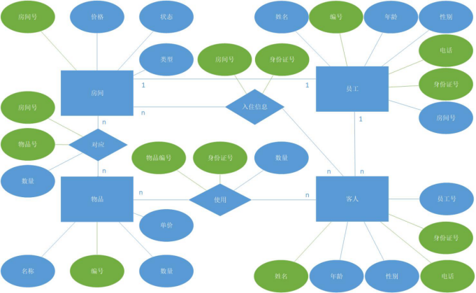

# 一、需求分析

## 1、环境要求

1、开发环境为Visual Studio，数据库为SqlSever

2、程序架构推荐三层架构下的WebForm或MVC

## 2、功能要求

1、员工注册与登录		

包含网站主页设计，员工信息注册与登录

​	2、管理员业务		

对注册员工进行信息审核以及对客房信息的增删改的功能

​	3、客房管理		

根据不同条件对客房信息进行检索，可以显示对应客房的详细信息

4、客房入住		

填写入住信息，对现有空房申请入住、或对某客房进行预约

5、财务统计		

可以根据时间段显示酒店目前的财务营收情况

6、退房结算		

根据客房入住时间对住房期间产生的费用进行结算

# 二、项目设计

## 1、功能设计

a、实现员工的分权登录，已登录用户可以查看所有员工的信息及比自己职位低的员工的所有信息。

b、实现员工的添加和删除及更新功能，同样需要权限验证机制。

c、实现对顾客的添加、删除、更新操作。

d、实现对房间的添加、删除、更新操作。

e、实现对物品的添加、删除、更新管理。

f、实现顾客租赁房间的订单管理。

## 2、界面设计

2.1 登录界面设计

 

2.2 员工界面

 

2.3 顾客管理

 

2.4  房间管理

 

2.5 物品管理

 

## 3、数据库设计

### 3.1 ER图设计

 

### 3.2 员工设计

| 属性名 | 类型 | 主码 | 描述 |
| ---------------- | -------------- | -------------- | -------------- |
| e_no             | INT(10)        | 是             | 员工编号       |
| e_name           | VARCHAR(20)    |                | 员工姓名       |
| e_age            | INT(3)         |                | 员工年龄       |
| e_gender         | VARCHAR(2)     |                | 员工性别       |
| e_tel            | VARCHAR(20)    | 是             | 员工电话号     |
| e_id             | VARCHAR(20)    | 是             | 员工身份证     |

### 3.3 客人设计

| 属性名 | 类型 | 主码 | 描述 |
| ---------------- | -------------- | -------------- | -------------- |
| g_no             | INT(10)        | 是             | 客人编号       |
| g_name           | VARCHAR(20)    |                | 客人姓名       |
| g_age            | INT(3)         |                | 客人年龄       |
| g_gender         | VARCHAR(20)    |                | 客人性别       |
| g_tel            | VARCHAR(20)    | 是             | 客人电话号     |
| g_id             | VARCHAR(20)    | 是             | 客人身份证     |


### 3.4 房间设计

| 属性名 | 类型 | 主码 | 描述 |
| ---------------- | -------------- | -------------- | -------------- |
| h_no             | VARCHAR(20)    | 是             | 房间编号       |
| h_price          | FLOAT          |                | 房间价格       |
| h_status         | VARCHAR(2)     |                | 房间状态       |
| h_type           | VARCHAR(10)    |                | 房间类型       |

### 3.4 物品设计

| 属性名 | 类型 | 主码 | 描述 |
| ---------------- | -------------- | -------------- | -------------- |
| o_no             | INT(10)        | 是             | 物品编号       |
| o_name           | VARCHAR(20)    | 是             | 物品名称       |
| o_number         | INT(4)         |                | 物品数量       |
| o_price          | FLOAT          |                | 物品价格       |

 

## 4、框架设计

本项目使用MVC框架。

# 三、软件开发

## 1、登录检测

后端判断主要代码

```C#
public static int checkLogin(string name, string password)
{
    int rst = 0;
    Employee employee = Employee_Dao.selectEmployeeByName(name);
    if (employee == null){
        rst = -1;
    }else{
        if (password.Equals(employee.EmployeePassword)){
            rst = 1;
        }else{
            rst = 0;
        }
    }
    return rst;
}
```

前端判断主要代码

```js
$(function () {
    $("#btn_login").click(function () {
        var txt_username = $("#username").val();
        var txt_password = $("#password").val();
        if (txt_username.trim()=="" || txt_password.trim() == "")
        {
            alert("请将内容补充完整!");
        } else {
            $.ajax({
                method: "post",
                url: "/GetInfo.ashx/?model=employee&type=login&username="+txt_username+"&password="+txt_password,
                success: function (result) {
                    switch (result)
                    {
                        case "-1":
                            alert("账号不存在！是否前往注册?");
                            break;
                        case "0":
                            alert("密码不正确！是否忘记密码?");
                            break;
                        case "1":
                            alert("登录成功！");
                            document.location.href = "index.html";
                            break;
                    }
                }
            });
        }
    });
});
```


## 2、员工管理

主要代码

```c#
public static List<Employee> selectAllEmployee()
{
    string sql = "SELECT e_no, e_name, e_password, e_gender, e_age, e_position, e_tel, e_id FROM employee";
    List<Employee> employees = new List<Employee>(); ;
    using (SqlDataReader sqlDataReader = SqlHelper.executeReader(sql, null))
    {
        while (sqlDataReader.Read())
        {
            Employee employee = new Employee();
            // 编号 姓名 密码 性别 年龄 职位 电话 身份证号
            employee.EmployeeNo = sqlDataReader.GetInt32(0);
            employee.EmployeeName = sqlDataReader.GetString(1);
            employee.EmployeePassword = sqlDataReader.GetString(2);
            employee.EmployeeGender = sqlDataReader.GetInt32(3);
            employee.EmployeeAge = sqlDataReader.GetInt32(4);
            employee.EmployeePosition = sqlDataReader.GetInt32(5);
            employee.EmployeeTel = sqlDataReader.GetString(6);
            employee.EmployeeId = sqlDataReader.GetString(7);
            employees.Add(employee);
        }
	}
	return employees;
}
```

## 3、顾客管理

主要代码

```C#
public static List<Guest> selectAllGuest()
{
    string sql = "SELECT g_no, g_name, g_gender, g_age, g_tel, g_id FROM Guest";
List<Guest> guests = null;
    using (SqlDataReader sqlDataReader = SqlHelper.executeReader(sql, null))
    {
        guests = new List<Guest>();
        while (sqlDataReader.Read())
        {
            Guest guest = new Guest();
            // 编号 姓名 性别 年龄 电话 身份证号
            guest.GuestNo = sqlDataReader.GetInt32(0);
            guest.GuestName = sqlDataReader.GetString(1);
            guest.GuestGender = sqlDataReader.GetInt32(2);
            guest.GuestAge = sqlDataReader.GetInt32(3);
            guest.GuestTel = sqlDataReader.GetString(4);
            guest.GuestId = sqlDataReader.GetString(5);
            guests.Add(guest);
        }
    }
    return guests;
} 
```

## 4、房间管理

主要代码

```C#
public static List<Room> selectAllRoom()
{
    string sql = "SELECT r_no, r_price, r_statu, r_type FROM room";
List<Room> rooms = null;
    using (SqlDataReader sqlDataReader = SqlHelper.executeReader(sql, null))
    {
        rooms = new List<Room>();
        while (sqlDataReader.Read())
        {
            Room room = new Room();
            // 编号 价格 状态 类型
            room.RoomNo = sqlDataReader.GetString(0);
            room.RoomPrice = sqlDataReader.GetDouble(1);
            room.RoomStatu = sqlDataReader.GetInt32(2);
            room.RoomType = sqlDataReader.GetInt32(3);
            rooms.Add(room);
        }
    }
    return rooms;
}
```

## 5、物品管理

```C#
public static List<RObject> selectAllObject()
{
    string sql = "SELECT o_no, o_name, o_number, o_price FROM object";
SqlParameter sqlParameter = new SqlParameter();
    List<RObject> mobjects = null;
    using (SqlDataReader sqlDataReader = SqlHelper.executeReader(sql, null))
    {
        mobjects = new List<RObject>();
        while (sqlDataReader.Read())
        {
            RObject mobject = new RObject();
            // 编号 姓名 数量 价格
            mobject.ObjectNo = sqlDataReader.GetInt32(0);
            mobject.ObjectName = sqlDataReader.GetString(1);
            mobject.ObjectNumber = sqlDataReader.GetInt32(2);
            mobject.ObjectPrice = sqlDataReader.GetDouble(3);
            mobjects.Add(mobject);
        }
    }
    return mobjects;
}
```


## 6、其他功能

分页功能

```C#
public static List<Employee> selectEmployeeByPage(int position, int pagesize, int page) {
    string sql = "SELECT TOP " + pagesize + " * FROM Employee WHERE  e_position <= " + position + " AND  e_no NOT IN(SELECT TOP " + (page-1) * pagesize + " e_no FROM employee ORDER BY e_no) ORDER BY e_no";
List<Employee> employees = new List<Employee>(); ;
    using (SqlDataReader sqlDataReader = SqlHelper.executeReader(sql, null))
    {
        while (sqlDataReader.Read())
        {
            Employee employee = new Employee();
            // 编号 姓名 密码 性别 年龄 职位 电话 身份证号
            employee.EmployeeNo = sqlDataReader.GetInt32(0);
            employee.EmployeeName = sqlDataReader.GetString(1);
            employee.EmployeePassword = sqlDataReader.GetString(2);
            employee.EmployeeGender = sqlDataReader.GetInt32(3);
            employee.EmployeeAge = sqlDataReader.GetInt32(4);
            employee.EmployeePosition = sqlDataReader.GetInt32(5);
            employee.EmployeeTel = sqlDataReader.GetString(6);
            employee.EmployeeId = sqlDataReader.GetString(7);
            employees.Add(employee);
        }
    }
    return employees;
}
```


# 四、实验总结

 通过这次实验，让我对ASP.NET搭建网站有了更深的理解，并且对开发工具VS2015的操作更加熟练，让我对MVC架构的理解有了更深刻的认识，让我对于ASP.NET的知识不仅仅局限于书本，对于ASP.NET的实践操作有了更深刻的认识。

 
